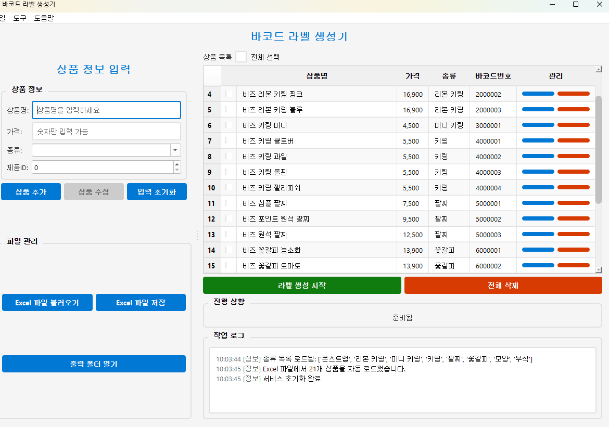

# 바코드 라벨 생성기 (Barcode Label Generator)

PyQt6 기반의 GUI 프로그램으로, 상품 정보를 관리하고 GS1-128 바코드가 포함된 Word 라벨 문서를 생성합니다.



## 주요 기능

### 1. 상품 정보 관리
- **상품 추가/수정/삭제**: GUI를 통해 직관적으로 상품 정보를 관리합니다.
- **Excel 연동**: `data/items.xlsx` 파일을 통해 상품 목록을 불러오고 저장합니다.
- **자동 ID 할당**: 새로운 상품 추가 시, 종류(카테고리)에 따라 다음 제품 ID를 자동으로 제안합니다.

### 2. 종류 (카테고리) 관리
- **종류 추가/수정/삭제**: 별도의 관리창에서 상품의 종류와 고유 `TYPE_ID`를 설정할 수 있습니다.
- **ID 무결성**: `TYPE_ID` 변경 시, 관련된 모든 상품 정보가 자동으로 업데이트됩니다.

### 3. 바코드 및 라벨 생성
- **동적 바코드 생성**: `TYPE_ID`와 `PRODUCT_ID`를 조합하여 `PPON-{TYPE_ID}{PRODUCT_ID}` 형식의 GS1-128 바코드를 메모리상에서 생성합니다.
- **템플릿 기반 라벨**: `templates` 폴더의 Word(.docx) 파일을 기반으로 라벨을 생성합니다.
- **자동 크기 조절**: 선택된 Word 템플릿의 셀 크기를 분석하여 바코드 크기를 자동으로 최적화합니다.
- **유연한 출력 옵션**:
  - 상품별로 개별 Word 파일 생성
  - 모든 라벨을 하나의 통합된 Word 파일로 생성
  - 상품별로 출력할 라벨 수량 지정 가능

### 4. 파일 관리
- **Excel 가져오기/내보내기**: 현재 작업중인 상품 목록을 다른 Excel 파일로 저장하거나 불러올 수 있습니다.
- **출력 폴더 관리**: 생성된 라벨 파일이 저장된 `output` 폴더를 열거나 내부 파일을 정리할 수 있습니다.
- **데이터 백업**: 현재 사용중인 `items.xlsx` 파일을 안전하게 백업합니다.

## 설치 및 실행

### 1. 의존성 설치
프로젝트에 필요한 라이브러리를 `uv`를 사용하여 설치합니다.
```bash
uv sync
```

### 2. 프로그램 실행
```bash
uv run python main.py
```

## 실행 파일 생성 (PyInstaller)

PyInstaller를 사용하여 배포 가능한 단일 실행 파일을 생성할 수 있습니다.

```bash
pyinstaller main.py --onefile --windowed --icon="img/barcode_icon.ico" --name "BarcodeLabelGenerator" --add-data "templates;templates" --add-data "img;img"
```

- `--onefile`: 모든 파일을 하나의 실행 파일로 묶습니다.
- `--windowed`: 실행 시 콘솔 창이 나타나지 않도록 합니다.
- `--icon`: 프로그램 아이콘을 지정합니다.
- `--name`: 생성될 실행 파일의 이름을 지정합니다.
- `--add-data`: `templates` 폴더와 `img` 폴더를 실행 파일에 포함시킵니다. (Windows: `;`, macOS/Linux: `:` 사용)

생성된 실행 파일은 `dist` 폴더에서 찾을 수 있습니다.

## 파일 구조

```
Barcode_Create_Word/
├── src/                    # 소스 코드
│   ├── models/             # 데이터 모델 (Product)
│   ├── services/           # 비즈니스 로직 (Excel, Word, Barcode)
│   └── ui/                 # PyQt6 사용자 인터페이스
├── main.py                 # 프로그램 메인 실행 파일
├── templates/              # Word 라벨 템플릿 파일 (e.g., 3677.docx)
├── data/                   # 데이터 파일
│   └── items.xlsx          # 기본 상품 데이터 Excel 파일
├── output/                 # 생성된 라벨 파일이 저장되는 폴더
├── img/                    # 아이콘 등 이미지 파일
├── pyproject.toml          # 프로젝트 설정 및 의존성
└── README.md               # 프로젝트 설명서
```

## Excel 파일 형식

`data/items.xlsx` 파일은 **product**와 **type** 두 개의 시트로 구성됩니다.

### 1. `product` 시트
상품의 개별 정보를 담습니다.

| PRODUCT | PRICE | TYPE_ID | PRODUCT_ID |
|---------|-------|---------|------------|
| 상품명1 | 10000 | 0       | 1          |
| 상품명2 | 25000 | 0       | 2          |
| 상품명3 | 12000 | 1       | 1          |

- **PRODUCT**: 상품의 이름
- **PRICE**: 상품의 가격 (쉼표 포함 가능)
- **TYPE_ID**: `type` 시트에 정의된 종류의 고유 ID
- **PRODUCT_ID**: 해당 종류 내에서 상품의 고유 ID (1부터 시작)

### 2. `type` 시트
상품의 종류(카테고리)를 정의합니다.

| TYPE    | TYPE_ID |
|---------|---------|
| 폰스트랩  | 0       |
| 리본 키링 | 1       |
| 팔찌      | 2       |

- **TYPE**: 종류의 이름
- **TYPE_ID**: 종류의 고유 ID (0 이상의 정수)

## 개발 정보

- **언어**: Python 3.11+
- **GUI 프레임워크**: PyQt6
- **의존성 관리**: `uv`
- **바코드**: `python-barcode` (GS1-128)
- **Word 문서 처리**: `python-docx`
- **Excel 데이터 처리**: `openpyxl`
- **이미지 처리**: `Pillow`